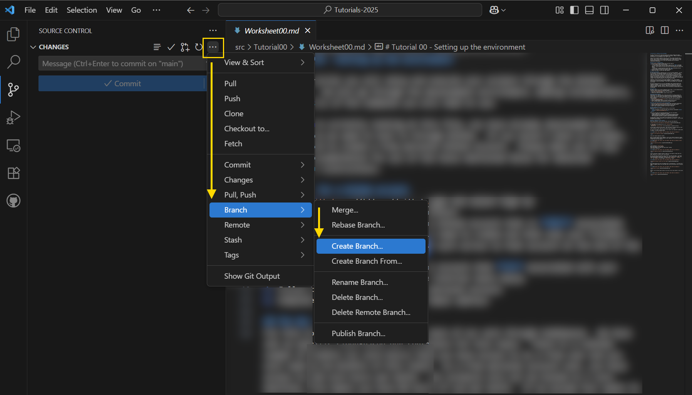

# Tutorial 00 - Setting up the environment

For this tutorial you will setup and execute your project through the GitHub CodeSpaces.  We will go through the development environment, adding collaborators, and the basics of the commands you will need to use.  These instructions have been created using markdown.  The source can be reviewed to identify symbols, tags, and notations for the production of markdown output.  If you are viewing this content in VS Code, you can click on the text here, and use the keyboard combination Ctrl+Shift+V to see a rendered version of the document.

Since you are currently looking at this file, you have already downloaded this project.  Now we need to host it through GitHub.  If you haven't done so already, you will need to create a free personal GitHub account.  Please make use of the excellent documentation for all of the tools mentioned below for detailed installation instructions.

### Sign up for a GitHub account
1. Go to [github.com](https://github.com) and select Sign Up
1. Use your Flinders email for your account 
    - if you have an existing personal GitHub account that is **NOT** associated with your Flinders email, you will need to create one that uses your Flinders details - you can copy all of your work we do in the topic, across to that account at the end of the semester
    - if you have an existing personal account that **IS** associated with your Flinders email, continue with the tutorial tasks below
1. Use your FAN as your username for your account (e.g., Timmy Turner's FAN would be **turn0123**)
1. Follow the prompts to create your personal account
1. Complete the tasks to verify your email address

## The dev environment
For this topic we will be completing most of our work through CodeSpaces.  We have set up specific cloud-based dev containers for this topic.  There is a limited number of credits (or core hours) that you have access to as a free user and you will need to be mindful of this limit.  As a free personal account user, you have access to 120 core hours per month.  Our projects will all be hosted on 2 core machines, this means you have 60 hours of use per month.  If we assume four weeks to a month and five work days per week, this would mean you would have 3 work hours per workday, if you worked on material for this topic every workday.

Sometimes, you may not want to work within CodeSpaces (e.g., you are making modifications to the User Research design documents), to enable this you will need to set up your local dev environment.  This local dev environment will include git and VS Code.

We will be using VS Code for all of our development (this includes drafting the assignment documents).  All instructions will assume VS Code as your IDE, if you choose to use another system, you are responsible for completing the required branching, commit, push/sync, and PRs.  These instructions are just for your own personal machines - you will not be able to set up VS Code as outlined below on the lab machines.

### Install Git
We need to install Git to ensure integration with VS Code.  If you already have Git installed, please continue on to the next section.
1. Go to [git-scm.com/downloads](https://git-scm.com/downloads)
1. Select your operating system
1. Install git, select any default options during install

### Install GitHub Desktop
GitHub Desktop is a GUI tool that can make some aspects of using git easier for novice users.  All instructions will assume that you are using GitHub Desktop for initial repo set up but there is the ability to do similar operations through git bash or GitHub.com.  If you choose to use different tools, you are responsible for troubleshooting.
1. Go to [desktop.github.com/downloads](https://desktop.github.com/download/)
1. Select your Operating System
1. Install GitHub Desktop, select any default options during install
1. Start up GitHub Desktop and Authenticate your GitHub account

### Install and setup VS Code on your local machine
1. Go to [code.visualstudio.com/download](https://code.visualstudio.com/download)
1. Select the operating system and install process for your local machine
1. Install VS Code, select any default options during the install
1. Open VS Code, complete any default set up that is required

### Add extensions to VS Code
Run VS Code and click on the Extensions button in the left menu 
<details open>
    <summary>Screenshot of VS Code Left Menu with Extensions highlighted</summary>
    <br />
</details>

Search for and install the following Extensions onto your environment:
  - Prettier (Identifier: esbenp.prettier-vscode)
  - GitHub Markdown Preview (Identifier: bierner.github-markdown-preview)
  - GitHub Pull Requests (Identifier: github.vscode-pull-request-github)
  - PHP Intelephense (Identifier: bmewburn.vscode-intelephense-client)

You may need to restart your VS Code for the extensions to take effect.  Your development environment is ready to start working with your projects.  First we need to host the repo on GitHub

### Host a repository on your account
Open GitHub Desktop, click on the File menu, and select New Repository
<details open>
    <summary>GitHub Desktop with New Repository highlighted</summary>
    <br />
</details>


For the name of the repository set it to `Tutorials-2025`.
> [!IMPORTANT]
> Name must be `Tutorials-2025` for the devcontainer to operate correctly

You may need to define the Local path.  This Local path is typically where all your local instances of your repos will be stored on your own machine.

For now you can keep all other options in the "Create a new repository" window blank or default - see the screenshot below.

<details open>
    <summary>Create a new repository window</summary>
    <br />
</details>

Click the "Create repository" button.

When the GitHub Desktop window reappears, click on the "Publish repository" button.  While you have created a local version of your repository, it will not be linked to a GitHub repo until you publish.

<details open>
    <summary>Publish repository button</summary>
    <br />
</details>

Leave the Name as `Tutorials-2025`.  
Add a Description of your choosing.  
Leave the checkbox for "Keep this code private" checked.  
Click Publish repository.

<details open>
    <summary>Publish repository details</summary>
    
</details>


Click on the Show in Explorer button to open up a File Explorer window where the empty repository is stored on your local machine.

Now copy and paste the entirety of this project into the repo folder.  You should only copy the folders within this project, i.e., don't copy the root folder, only copy the internals of the project.  You would copy `.devcontainer`, `.github`, `src`, and `README.md` into the empty `Tutorials-2025` folder.

<details open>
    <summary>Copying the project content into the repo</summary>
    
</details>

Open GitHub Desktop and note the changed state of the application.  You should see a number of changes listed in the left panel and a diff of the active file in the main panel.

You need to provide a Commit Message, Commit Description, and click the Commit button.

<details open>
    <summary>Committing the repo</summary>
    
</details>

Finally, hit the "Push origin" button to sync your local repo contents to the online repo.

<details open>
    <summary>Syncing repos</summary>
    
</details>

### Starting our first Codespaces session

Click the "View on GitHub" button.  This will load your web browser and open GitHub on this repo.  You should see that the root of the project is shown in a folder structure and the initial README.md content is displayed.  We will now open our first Codespace environment.

Click on the "< > Code" button and click on the right tab "Codespaces".

Click on the "Create codespace on main" button.  The process of setting up your Codespace can take a few minutes, especially the first time.  You can click on the pop-up in the bottom right corner of the window to see the progress of the devcontainer creation.

<details open>
    <summary>Creating the Codespace</summary>
    
</details>

Once it has completed you will see that you have a very similar environment to your VS Code IDE.  There would be a few more extensions in the left menu but the only additional one that we will need to worry about (in tutorial 06) is the database extension.  Once everything has loaded in, you should see a screen similar to this one.

<details open>
    <summary>Codespace IDE</summary>
    
</details>

In the bottom panel, you should see a Ports tab. Click on the tab and there should be one entry in the list.  Hover over your machine name (typically a randomly generated unusual name) and you will see a number of icons overlayed on the machine name.  
Click on the Globe icon.  
This will open a new tab in your browser and load an index page.  The successful load of the index page, indicates that your system is configured correctly.

<details open>
    <summary>Successful devcontainer set up</summary>
    
</details>

### Adding collaborators to our repository

Now return to the tab in your browser where you have github.com open.  We will now add collaborators to our project.

Across the top of the panel you should see a collection of tabs for various activities:
<details open>
    <summary>Tabs in github.com</summary>
    
</details>

Click on the Settings tab and locate the Access - Collaborators button (should be the top item of the left menu).  In the panel that opens up, click on the Add People button.

Turn to the person sitting next to you ask for their github username. Enter this into the field and click Add to repository.

You should both now have access to the same repository.  We will now work through the process required to make any changes to your work.

### Updating content in the repo

For every edit, addition, deletion, or small change that you will work on with your repositories, you will follow the same steps outlined below:
1. Identify a change is required
1. Ensure your `main` branch is up-to-date
1. Create a branch from the `main` branch
    - Your branch should have a name that starts with the type of change, followed by a /, then your FAN, then another /, then a brief two to five word statement about the change (use hyphens to separate words), e.g.,:
        - `feature/turn0123/new-login-system`
        - `bugfix/turn0123/incorrect-data-display`
        - `docs/turn0123/update-research-methods-section`
1. Make the changes to the project in your branch
1. Commit your changes to your branch
1. Sync or push your changes
1. Submit a Pull Request (PR) to have someone review your contribution
1. Another person in your team is responsible for reviewing and accepting your change, they will follow these steps:
    1. Once a PR is submitted, review the changes
    1. If satisfied with the changes, report with comments the success of the change
    1. Merge the branch with `main`, resolve any merge conflicts with the author of the PR
    1. DO NOT delete the branch

### Let's practice!

With the person you are currently sharing your repo with, you need to change the following two lines in this document, each person should change the content for one of the lines to represent their details.  Read all the instructions below first and then implement the steps to make the necessary changes.

---

- Name of Team Member 1, FAN, Degree
- Name of Team Member 2, FAN, Degree

---

**Step One** is to identify a change is required, e.g., we want to modify the two lines above.

**Step Two** is to ensure the `main` branch is up-to-date.  There are various ways to do this, but we will use VS Code to complete this step.  Click on the Source Control button in the left menu and if there has been any changes to the `main` branch you would see a button like the following:

<details open>
    <summary>Make sure main branch is up-to-date</summary>
    
</details>

For your repo, for this step, you are not likely to see any changes that need to be sync'ed at this stage.

**Step Three** is to create a new branch for the changes you want to make.  Each person should create a branch and use the naming conventions above for modifying this doc.  To create a branch in VS Code:
- click on the Source Control button, if you are not currently looking at the Source Control panel
- hover over **CHANGES** in the Source Control panel
- five widget buttons should appear when you hover, click on the elipses (...)
- go down to Branch, and select Create Branch

<details open>
    <summary>Create a branch</summary>
    
</details>

In the panel that opens for a prompt at the top of the window, type an appropriate branch name (using the conventions above), e.g., `docs/wilk0077/update-my-details`.  Hit Enter.  
Click the Publish Branch button.

**Step Four** you make the changes to the document for your name and details - note that when you make those changes the content in the Source Control panel changes.  You should see the Commit button is highlighted, and a list of Changes has been included (M next to the file name denotes it has been modified).

Verify that the content in the text box of the Source Control panel correctly identifies the branch that you are in, e.g.,  
`docs/YOUR-FAN/update-my-details`

<details open>
    <summary>Source Control shows changes and the branch for those changes</summary>
    
</details>

**Step Five** click in the text box and write a suitable commit message.  Your commits should be descriptive.  Imagine you are reviewing a PR and someone pushed a commit with the message "changed files" - this does not provide enough context or information.

Ideally, your commit messages should follow this structure:
```
type(scope): subject
body
```
Where:
- type:
    - feat - a new feature
    - fix - a bug fix
    - docs - changes in documentation
    - style - style changes, formatting, missing semicolons or whitespaces
    - refactor - code that neither fixes a bug or adds a feature
    - perf - changes that improve performance
    - test - add a missing test
    - chore - regular code maintenance
- scope:
    - a phrase describing parts of the code or files affected by the change
- subject:
    - a short description of the applied changes (no more than 50 characters)
- body
    - must begin one blank line after subject.  Should provide additional contextual information.  If the subject provides enough detail, this can be removed.

So, for your commit message add something like:
```
docs(Worksheet00): Replace the placeholder text with details

Details were my name, FAN, and my degree. Changes were implemented on line 192
```

<details open>
    <summary>Commit message</summary>
    
</details>

When typing in your commit message, just use Enter to add a new line to the text box.

Hit the Commit button.  In the prompt that appears you can select Yes.  For our simple projects, we could click Always and not deal with the pop up every time, but it is best to review and verify everything before you stage (or commit) your work.

The Commit button has changed to a Sync Changes button.  Clicking this button will push your content to the remote repository at github.com.  In the pop up that appears, click OK to push your content to the repo.

**Step Seven** is to submit the Pull Request, i.e., ask someone in the team to review and accept your code changes.  In VS Code, in the Source Control panel, hover over CHANGES again and note the third widget Create Pull Request.

<details open>
    <summary>Create Pull Request button</summary>
    
</details>

When you click Create Pull Request the CREATE panel will replace the CHANGES panel.  This panel will show a default template for a Pull Request.  We have set up a template for you to use, so that there is consistency within your project.  You will see that the panel shows:
- BASE - where the changes will be merged into, i.e., `main`
- MERGE - the branch we are working in
- Subject block - this is taken directly from the commit statement
- Body block - content from the commit is added to the start of the body.  Where necessary, for a reviewer to understand what the change is and what it will affect, you should include a longer description.  There is also a checkbox list to help identify what change has occurred, simply place an x inside the square brackets to check that item.  Then finally, there is a checklist to ensure you have completed the necessary steps, make sure you place an x in each appropriate item.  Finally, the last checkbox is to indicate who you have assigned this PR to.

<details open>
    <summary>Pull Request Template</summary>
    
</details>

To assign this PR to one of your team members, click the widget that looks like an avatar within a circle (highlighted in the previous image).  From the list that appears, select the other person who you are sharing your repo with.  Click Ok - that person will now appear under the subject line of the Pull Request.

Once you have completed the necessary details, click the Create button.

**Step Eight** once you have a PR assigned to you, you will need to review it and if it is suitable, create a merge commit.  When reviewing a PR, you must leave a Comment.  This should be a short statement that identifies that this PR has been reviewed and why the code changes should be merged.

In the PR review page you will see the list of changes as the filenames of the files that were changed.  Click on a file name will show you that file and the change that was made.  

<details open>
    <summary>Window showing the PR and the changes made to the file</summary>
    
</details>

If you feel the change is appropriate and won't break your code, leave a comment, and click Create Merge Commit.

This is the process that you should follow for each change you make to your repo.  This is crititcal for your assignment work and your marks will be adjusted based on your interactions with this process.

Congratulations :tada::tada::tada:.  You have completed the set up of your tutorials project.  Next week we will add a new folder to this repository and work through some examples.