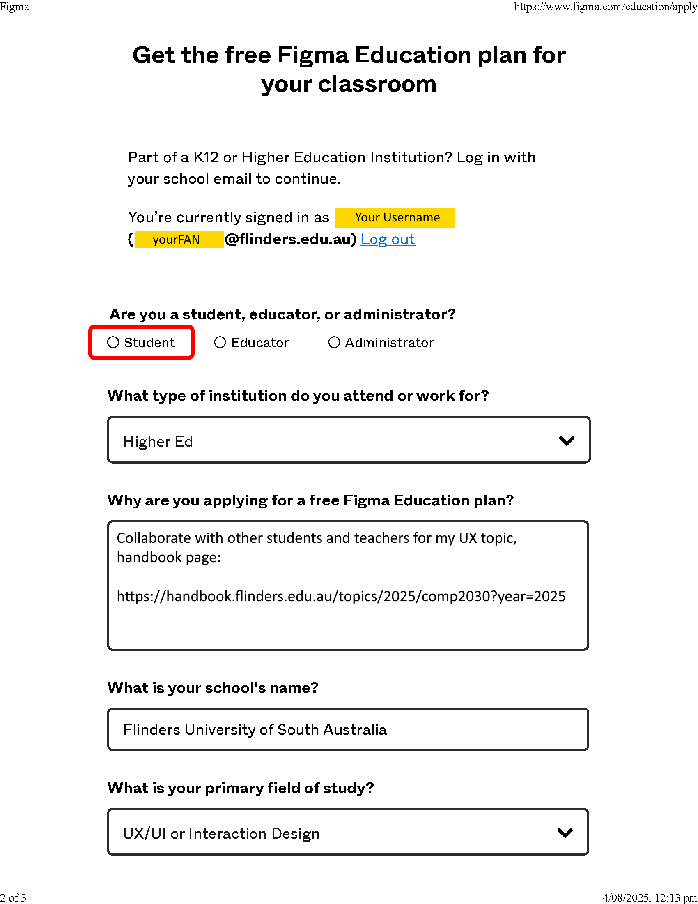
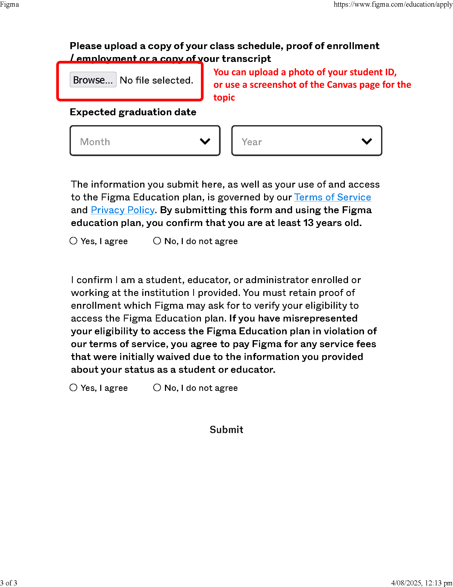

# Tutorial 01

This tutorial (held in Week 02) will look at the process for conducting a PACT analysis. 

Typically, the tutorials will be broken into distinct tasks where you are encouraged to either work in small groups or discuss the material openly with the wider tutorial class.  Where applicable, the tutorial tasks will relate directly to your assignment development.  Engagement with this process will assist your understanding of the assignment requirements and may contribute toward the deliverables.

For this tutorial we will start working with Figma to capture some of our brainstorming around the users for our systems.  Figma will be the tool that will be used to create the Personas and the Wireframes.  Once you have developed these artefacts you will export them as PNGs.

## Setup Figma
You will need to create a free education account on Figma.  
- Start by going to [figma.com](https://www.figma.com)
- Click on Get started for free (top right of the screen)
- Use your Flinders university email, e.g., ffan1234@flinders.edu.au
- Set a suitable password
- Fill out the required details, indicating that you will be using Figma for education, teaching or learning

This will give you access to a free account - very limited.

Click on this link to access the Human Factors Tutorial Figma team: [https://www.figma.com/team_invite/redeem/eEizxF6ChfLXMu9OkPIkNo](https://www.figma.com/team_invite/redeem/eEizxF6ChfLXMu9OkPIkNo)

Once in the Team, you will see a blue banner across the top of the page that says you have 7 days to verify your education status.

Click on the Verify button on the right.

On the page that is displayed:
- Select Student
- Fill in the details required
    - What type of institution - Higher Ed
    - Reason: Collaborate with other students and teachers for my UX topic, also copy one of the following links into the Reason text box to demonstrate the topic that you are doing:

    Undergrad: https://handbook.flinders.edu.au/topics/2025/comp2030?year=2025 \
    Masters: https://handbook.flinders.edu.au/topics/2025/comp9030?year=2025 \

    - School's Name: Search for Flinders University of South Australia
    - Primary Field of Study: UX/UI or Interaction Design
    - Click the Browse button: Upload a screenshot of the Canvas Home page for the topic
    - Expected Graduation Date: relevant date
    - Agree to the terms

    
Annotated screenshots of the form

    
        

Once you have access to the Figma team:
- Create your own Project - name it your FAN
- Go to the Team project
- Duplicate PACT Analysis (MASTER)
- Drag and drop PACT Analysis (MASTER) (Copy) into your FAN project
- Rename the PACT Analysis (MASTER) (Copy) in your FAN preoject to PACT Analysis
- You will use this document to capture your discussions below

For this tutorial you will be conducting a PACT analysis.  It is important for you to take notes with each task so you can discuss and compare your findings throughout the tutorial.

## Task 01
We conduct a PACT analysis to understand who are users are.  This brainstorming exercise allows us to elucidate the various characteristics that define the user, their purpose for the technology, the context within which they are engaged with the system and the types of interactions they will employ.  The first step is to identify the P's or the People.

In a small group of four or five, discuss the requirements for your web site (FUSS or Indigenous Art Atlas) and determine who the stakeholders for the web site are.  Remember to consider all the functionality of the service, also note that a user may have multiple roles when engaging with this service.  Spend five minutes discussing this and then report back to the wider tutorial group the list of users that you have compiled.

## Task 02
Now we have a list of people who may be using our service we need to consider their individual characteristics.  If you are not currently in a group, you should find other people in the tutorial (get up and move around) and discuss the physical differences of the user type you have selected.  When considering the physical characteristics spend a brief time on each of the following:

- Physical Characteristics
- Senses
- Accessibility Considerations
- Ergonomics

Spend five minutes brainstorming the physical differences for the user you have selected.  Return back to your previous desk and the first group you worked with and compare your notes.

Document these characteristics in the People section on your version of the Figjam file.

## Task 03
Now we need to consider the psychological and social differences of our users.  Discuss with your current group the following characteristics for your selected user:

- Psychological
    - Perception
    - Attention
    - Memory
- Social
    - Purpose for use of the system
    - Level of skill (beginner, intermediate, expert)
    - Type of user (primary, secondary, tertiary)
Spend five minutes completing this task.

Document these characteristics in the People section on your version of the Figjam file.

Export the current Figjam content as a PNG.
- Click on the Figma 'F' menu (top right)
- File -> Export As... -> leave as PNG
- Click Export
- Copy the exported file into the imgs folder of this repository

Attach a copy of your notes as an image here: \

## Task 04
Now we need to consider some of the activities that the user will want to complete with our system.  The activities themselves can be short, simple tasks or long and highly complex.  We need to define what the purpose of the activity will be.  Find a new group and decide on an activity for the users of our system.  In your new group define the following characteristics about the activity you have chosen:

- Temporal
- Cooperation
- Complexity
- Safety-critical
- Nature of content

Spend five minutes discussing this, then report the activity and its characteristics back to the wider tutorial group.

Document these characteristics in the Activities section on your version of the Figjam file.

Attach a copy of your notes as an image here: \

## Task 05
Finally, we need to consider the context and technologies that will influence our users in their use of our system.  Activities always happen in a context.  Context is sometimes seen as surrounding an activity, but can also be features that link activities together into a coherent whole.  Technology are the tools that enable the interaction.  Return to your original group and consider the following items:

- Context
    - Physical
    - Social
    - Organisational
- Technologies
    - Input
    - Output
    - Communication
    - Content

Spend five minutes discussing this.

Document these characteristics in the Context and Technologies section on your version of the Figjam file.

Attach a copy of your notes as an image here: \

By the end of this session you should have some notes or a dot point list of features that define a user of our system.  Use this process in your own time to try and define and identify the various types of users for our system.  You will then be able to consolidate these notes into a coherent structure for your PACT analysis task for the Design assignment.