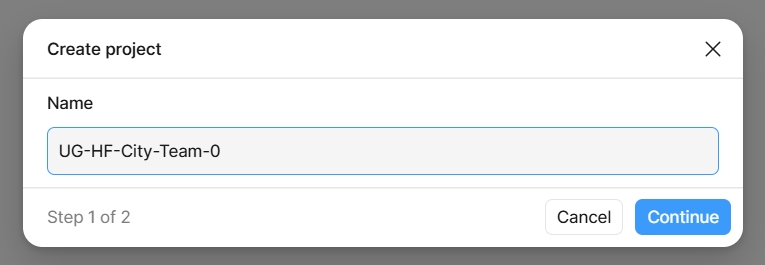
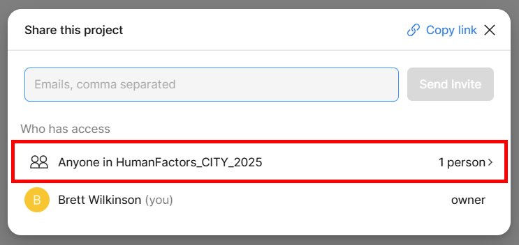
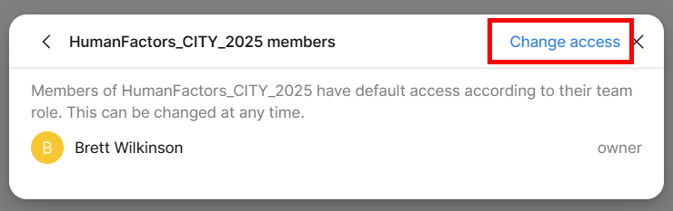
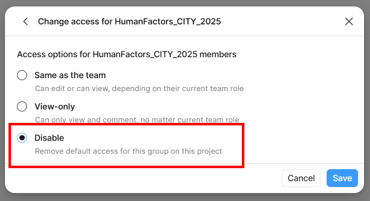
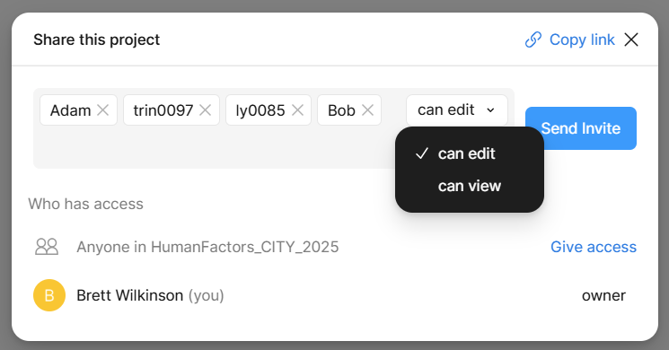
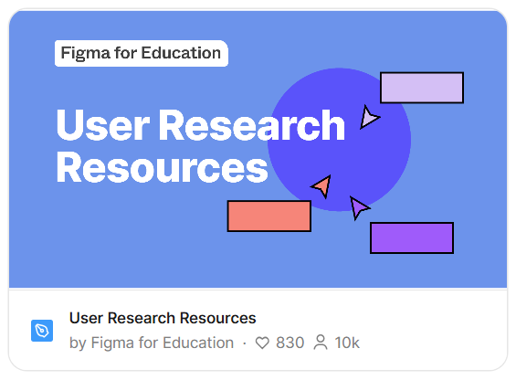
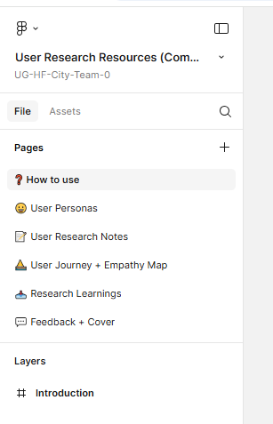
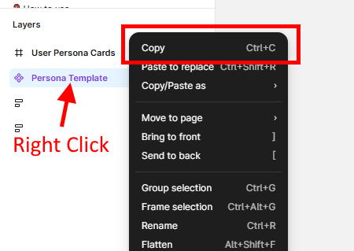

# Tutorial 02

This tutorial (held in Week 03) will look at the process for creating the Persona Poster in Figma. 

Typically, the tutorials will be broken into distinct tasks where you are encouraged to either work in small groups or discuss the material openly with the wider tutorial class.  Where applicable, the tutorial tasks will relate directly to your assignment development.  Engagement with this process will assist your understanding of the assignment requirements and may contribute toward the deliverables.

We will be working in out assignment repos, working through the update changes with branches process.  This will give you practice with the process and allow you to observe how merge conflicts can occur and what you need to do to resolve them.

For this tutorial we will use a template and work with our team on the early draft of our persona.

For this tutorial, you will need to have access to Figma, i.e., have set up and verified your Education account, have your GitHub and local development environment setup, and have reviewed the material on Personas.

We will start by creating a suitable Figma workspace and use an existing template.  We will then capture our thoughts and notes in a markdown file in our assignment repo, before finally adding some content to the Figma template.

## Task 01

Use the links below to access one of the following Figma projects (you will need to sign into your Figma account):
- [City](https://www.figma.com/team_invite/redeem/3V7m0dvd0PBNzKmplOUtLX)
- [Tonsley](https://www.figma.com/team_invite/redeem/2ZzoymoW8ySAbVKdv4DS0N)
 
We are going to create a new project and then restrict access to the project except to the members of our team.  

 

### <mark>*One person</mark>* in your team should follow the instructions below.

  

1. Click on the + Project button to create a new project
2. Name the project with the following convention:
   1. Use hyphens to separate words
   2. Start with your degree type, either **UG** for undergrad or **PG** for postgrad
   3. Your assignment team name, e.g., HF-City-Team-1
   4. This will give you a project name like: <mark>**UG-HF-City-Team-1**</mark>
   

       
Create Project Example

       
   

3. Click Continue
4. Don't change any content on the next popup
5. Click Create project
6. If the Starred icon (top right of the window) is not highlighted, click it to ensure your project appears in the left panel for easier access
7. Click on the Share button (top right of window)
8. In the popup that appears, click on the "Anyone in HumaFactors..." line
   

       
Select who can access the project

       
   

9.  Then click on "Change Access in the popup that appears
    

       
Change the access

       
   

10. Select the option Disable.  This will lock your project down so that only you have access to it
    

       
Select the Disable option

       
   

11. Click Save.
12. Finally add the email for each of your team members into the send invite section.  When you have entered in an email, conclude it with a semicolon ( ; ) to start a new email address, e.g., <mark>adam.eustis@flinders.edu.au; trin0097@flinders.edu.au; ly0085@flinders.edu.au; robert.wright@flinders.edu.au;</mark>

13. Change the **can view** option to **can edit**
14. Then click Send Invite.  Your Team should now all have access to the same project and others in the topic will not be able to see it.

    
Invite collaborators

    

## Task 02

We will make use of an existing template which you are free to modify and extend as needed.

1. Click on the Templates and tools option in the left hand panel
2. In the Search box (top right of window), search for "**user research resources**"
3. Near the top of the returned results you should see the following template, double click on it to open a popup.

    
User Research Resources template

    

4. Select Open in Figma
5. Click on the drop down next to the file name at the top of the left panel and select Move File...
6. In the list of the Suggested projects, find and click on your personal team project and then click the Move button

Once you have the Figma Design workbook in your group space, review the content on the cover page.  Then using the navigation Pages section on the left of the screen review each of the additional pages in this workbook.

    
Figma Left Menu

    

We will add additional pages to the workbook for our own project.

## Task 03

For this task you will start the process of creating a Persona document to represent one of your expected users for the assignment project.  

1. Create a new page in the Pages section on the left side of the screen - name the new page Persona 1.
2. Drag it to the top of the Pages list, so that it is easy to access.
3. Open the :) User Personas page.
4. Right click on the Persona Template heading in the Layers section and select Copy.

    
Copy an existing Figma template

    

5. Open your Persona 1 Page and right click in the open workspace and select Paste here.
6. This can act as the starting template for your Persona - you are also free to create your own.

## Task 04

### <mark>*ALL people</mark>* in your team should follow the instructions below.

Now we will work between our Figma and Assignment GitHub projects.  Each person in the group will be responsible for a different aspect of the content that is to be created and must follow the update steps, e.g.,:
- Fetch `main`
- Create and publish a dev branch (use the naming conventions provided)
- Make your changes
- Commit the changes
- Push the commit
- Create a Pull Request and assign a group member to that PR
- Review the PR and merge the changes

1. For this task each group member will be required to compile a list of attributes for the persona and document them in a draft folder, i.e., `AssignmentROOT/project-docs/drafts/`
2. If necessary, fetch the current version of `main` from the Assignment repo from GitHub and open your it in VS Code.
3. One person should create a new markdown file named: `persona-drafts.md` in the `drafts` folder.
4. Once `persona-drafts.md` has been created, as an individual, create your dev branch.
5. Each person in the group should be allocated a line number to start their version of the documetn at, e.g., 
  - Team Member 1 starts at line 2, 
  - Team Member 2 starts at line 20, 
  - Team Member 3 starts at line 40, etc.  
6. Add the following sub heading to the document, at your designated line number:\
`## Persona Details - FAN` *where FAN is your actual Flinders FAN*

## Task 05

A Persona is a tool that is used to help developers identify their target audience for their app.  The Persona artefact is typically a poster that is displayed prominently and used for ongoing discussion and clarification within the development team.

For the intended application that you will be designing and developing, work with your team and identify a name for your persona, some of the demographic, grokkability, and the hardware details for your target user.

Each team member is responsible for updating their own section of the `persona-drafts.md` file.  The idea is to put your own thoughts into the document and then once combined you have a working document where everyone has contributed work.

Where is there similarity in ideas?  Where is there contradictions?  Why do you think this is the case?

Perform the commit, push, PR process to ensure all work is captured and merged back to the `main` branch.

## Task 06

Now with all the ideas collected on the one document, consider how these details can be added to your Persona poster.

Return to Figma and either start editing the existing template, or create your own from scratch.

To access specific elements of the Template, double click on the item, until it is shown in the Layers panel.

If you start fresh, you will need to use a Frame as the root layer for your persona.  Click on the Frame button in the tool palette and then click and drag to create a workspace.

You can then build up the complexity of your persona but incorporating other frames, elements, and features as their own layers or nested layers.

By the end of the session, you should have a working start on the Persona poster and can continue to flesh it out in your own time.